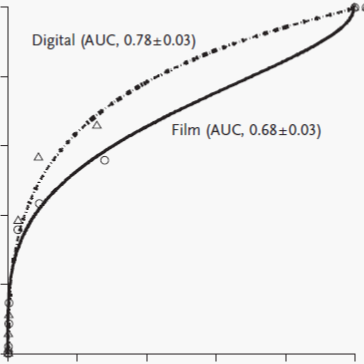

```{r setup, echo=FALSE, warning = FALSE}

library(xlsx)

knitr::opts_chunk$set(echo = FALSE)
knitr::opts_chunk$set(warning = FALSE)
# knitr::knit_exit()

captions <- list()
titles <- list()

# The reference_docx in the YAML header does three distinct things to knit word documents
#   1. Sets font to Times New Roman
#   2. Sets paragraph options to double space
#   3. Sets Heading 5 (##### in the document) to create a page break

# title: "Impact of Prevalence and Case Distribution in Lab-based Diagnostic Imaging Studies"
# date: '`r format(Sys.time(), "%d %B %Y")`'

# This flag determines whether images are printed to eps file (TRUE)
# or displayed in the manuscript (FALSE).
# We need to knit this document twice. Once to produce the eps files
# and then again so the figures appear in the document.
epsFlag <- TRUE
epsFlag <- FALSE

# This controls whether the tables appear in the document or not.
figResults <- "hide"
figResults <- "markup"

```

```{r readData}

viperObs <- viperData::viperObs455
viperSummary <- viperData::viperSummary455

readerQualifications <- viperData::viperReaderQualifications
dmistData <- viperData::dmistData

```

#####  Full Title Page

**Title:** "Impact of Prevalence and Case Distribution in Lab-based Diagnostic Imaging Studies"

This work is an original investigation article.

**Authors and Affiliations**

 * Brandon D. Gallas, PhD ^a^
     * **Corresponding Author**
     * brandon.gallas@fda.hhs.gov
     * 301-796-2531 (office)
     * 301-796-9925 (fax)
     * 10903 New Hampshire Ave, WO62-4104, Silver Spring, MD, 20993
 * Weijie Chen, PhD ^a^
     * Weijie.Chen@fda.hhs.gov 
 * Elodia Cole, MS ^b^
     * ebcole.be@gmail.com 
 * Robert Ochs, PhD ^c^
     * Robert.Ochs@fda.hhs.gov 
 * Nicholas A. Petrick, PhD ^a^
     * Nicholas.Petrick@fda.hhs.gov
 * Etta D. Pisano, MD ^b^
     * etpisano@gmail.com
 * Berkman Sahiner, PhD ^a^
     * Berkman.Sahiner@fda.hhs.gov
 * Frank W. Samuelson, PhD ^a^
     * Frank.Samuelson@fda.hhs.gov 
 * Kyle J. Myers, PhD ^a^
     * Kyle.Myers@fda.hhs.gov 

**Affiliations:**

 a. **Institution from which the work originated**: FDA/CDRH/OSEL/Division of Imaging, Diagnostics, and Software Reliability, 10903 New Hampshire Ave, WO62-4104, Silver Spring, MD, 20993-0002.
 b. Medical University of South Carolina, 171 Ashley Ave, Charleston, SC 29425.
 c. FDA/CDRH/OIR/Division of Radiological Health, 10903 New Hampshire Ave, WO66-4312, Silver Spring, MD, 20993-0002.

#####
\newpage

## Abstract

**Ratonale and Objectives** We investigated effects of prevalence and case distribution on radiologist diagnostic performance as measured by area under the receiver operating characteristic curve (AUC) and sensitivity-specificity in lab-based reader studies evaluating imaging devices.

**Materials and Methods** Our retrospective reader studies compared full-field digital mammography (FFDM) to screen-film mammography (SFM) for women with dense breasts. Mammograms were acquired from the prospective Digital Mammographic Imaging Screening Trial (DMIST). We performed five reader studies that differed in terms of cancer prevalence and the distribution of non-cancers. Twenty radiologists participated in each reader study. Using split-plot study designs, we collected recall decisions and multi-level scores from the radiologists for calculating sensitivity, specificity, and AUC.

**Results** Differences in reader-averaged AUCs slightly favored SFM over FFDM (biggest AUC difference: 0.047, SE=0.023 p=0.047), where standard error (SE) accounts for reader and case variability. The differences were not significant at a level of 0.01 (0.05/5 reader studies). The differences in sensitivities and specificities were also indeterminate. Prevalence had little effect on AUC (largest difference: 0.02), whereas sensitivity increased and specificity decreased as prevalence increased.

**Conclusion** We found that AUC is robust to changes in prevalence, while radiologists were more aggressive with recall decisions as prevalence increased.

**Keywords** Image Evaluation, Study Design, MRMC analysis, AUC, Sensitivity, Specificity

#####
\newpage

## 1. Introduction

Lab-based reader studies are often used to evaluate imaging technologies and are typically characterized by 1) a moderate number of cases that may not represent the true patient population (e.g., higher disease prevalence because of enrichment); 2) structured and quantitative case reports based on a narrow task that is often a simplification of the clinical task (e.g., the radiologist only evaluates the images and is blinded to patient information); and 3) retrospective reads with no impact on patient management. Here we report on lab-based reader studies in a project we refer to as VIPER, Validation of Imaging Premarket Evaluation and Regulation. The setting for this validation is the comparison of a new imaging modality to a reference imaging modality. The data from such studies may be used to support Food and Drug Administration (FDA) clearance or approval of medical imaging devices and computer aids. VIPER was born from a desire to validate the use of lab-based studies as an alternative to large prospective clinical trials.

One of the largest prospective clinical imaging trials with data available conducted at the time of VIPER’s conception (2010) was the Digital Mammographic Imaging Screening Trial (DMIST) [@Pisano2005_NEJM_v353p1773; @Pisano2005_Radiology_v236p404]. DMIST was designed to compare full-field digital mammography (FFDM) to screen-film mammography (SFM), pooling results from five different FFDM platforms and six different SFM platforms. DMIST was sized to detect an AUC difference of 0.06 between FFDM and SFM with 5% Type I error and 80% power. This requirement and the low prevalence of breast cancer in the screening population drove the study to enroll 49,528 women, with all relevant information obtained for 42,760 subjects. Such a study is too expensive for a single manufacturer or investigator to afford, so many turn to lab-based reader studies.

For decades psychophysical signal-detection experiments have demonstrated the effects of prevalence on decision threshold [@Ulehla1966_J-Exp-Psychol_v71p564; @Wolfe2005_Nature_v435p439]. Egglin and Feinstein [@Egglin1996_JAMA_v276p1752] found significant differences in sensitivity, specificity, and AUC of radiologists diagnosing pulmonary emboli at 20% and 60% prevalence. Gur et al [@Gur2003_Radiology_v228p10; @Gur2003_Acad-Radiol_v10p1324] compared radiologists’ performance in diagnosing several different pathologies in several different prevalence conditions and found no significant differences in AUC but found significant shifts in those radiologists’ ratings [@Gur2007_Acad-Radiol_v14p49].   However, Gur et al. [@Gur2008_Radiology_v249p047] did find a significant difference in performance between mammographers interpreting screening mammograms in the clinic and in a laboratory study with higher prevalence. Evans et al. [@Evans2011_Arch-Pathol-Lab-Med_v135p1557] demonstrated the effects of cytologists’ decision thresholds as a function of prevalence of cervical cancers. With different coauthors Evans also showed that radiologists mark more cases as cancer in a highly enriched setting (50% prevalence) compared to when the same cases were inserted into their normal screening service workflow [@Evans2013_PloS-One_v8pe64366]. The current work builds on this literature.

The purpose of VIPER is to investigate the effects of prevalence and case-distribution on radiologist performance detecting cancer as measured by AUC and sensitivity-specificity in lab-based reader studies evaluating imaging devices. We use a data-collection method that enforces consistency between the clinical (binary) recall decision and ROC scores, and we compare the sensitivity-specificity operating points measured in VIPER to those found in the prospective DMIST study. Initial results of this paper were presented at the SPIE Medical Imaging Conference [@Gallas2017_Proc-SPIE_v10136p0A]. The patient population in VIPER is limited to women with dense breasts, which was a DMIST sub-population where FFDM was found to significantly outperform SFM (AUC for FFDM was 0.78, SFM was 0.68). The main VIPER hypotheses test the differences in AUCs from FFDM and SFM across five reader studies. The studies differ in terms of their study populations, namely, the prevalence and the distribution of non-cancer cases.

This research did not receive any specific grant from funding agencies in the public, commercial, or not-for-profit sectors.

## 2. Materials and Methods

VIPER was conducted at the Medical University of South Carolina (IRB 13890) from September 2013 to August 2015 as a retrospective image evaluation study. The images used in VIPER are from the ACRIN (American College of Radiology Imaging Network) DMIST trial [@Pisano2005_NEJM_v353p1773; @Pisano2005_Radiology_v236p404] and were acquired from ACRIN. In addition to images, ACRIN provided Breast Imaging Reporting and Data System (BIRADS) management scores and cancer determinations (based on pathological verification for cancer and up to 455 days of follow-up for non-cancer) as per the original DMIST study design. ACRIN removed patient identifiers from all clinical images and data, in accordance with the primary requirements of HIPAA.

### 2.1 Subjects=Cases

```{r Fig1.ParticipantFlowDiagram, fig.width = 6, fig.cap=captions$fig1, results=figResults}

captions$fig1 <- paste(
  "Figure 1: Participant flow diagram.",
  "Screening and Challenge sub-studies of different prevalences",
  "are created from the final subgroups based on",
  "DMIST screening BIRADS scores by FFDM and SFM.",
  "The last row differs from the one above it due to availability from ACRIN."
)

knitr::include_graphics(file.path("fig1participantFlow.png"))

```

Eligibility for inclusion in VIPER required that the BIRADS breast density classification documented in DMIST be 3 or 4 by SFM [@BIRADS2003_4thEd]. These are women with heterogeneously and extremely dense breasts, categories "c" and "d" in the current lexicon [@BIRADS2013_5thEd]. The participant flow diagram is given in Figure 1. The age range of the women in VIPER was 33 to 86 (mean: 54).

### 2.2 Split-Plot Study Design

Given the available cases, we designed five split-plot reader studies [@Obuchowski2012_Acad-Radiol_v19p1508]. In a split-plot study, readers and cases are split into groups and each reader group is assigned a case group. Each split-plot group is, in effect, a fully-crossed study (within that group): a study where every reader reads every case in both modalities. In other words, every reader in reader-group 1 reads every case in case-group 1, every reader in reader-group 2 reads every case in case-group 2, and so on. Each of the VIPER reader studies had four split-plot groups. A split-plot study can be more efficient statistically and more efficient in terms of resources compared to a fully crossed study [@Obuchowski2012_Acad-Radiol_v19p1508; @Chen2018_J-Med-Img_v5p031410]. We describe the reader studies below and provide more details in the Supplementary Materials [@Gallas2018_J-Med-Img_acceptedSuppl]

### 2.3 Five VIPER Study Populations

```{r Table1: Per-reader cancer prevalence, results=figResults, comment=NA, results=figResults}

table1.VIPER <- data.frame()
for (v.summary in viperSummary) {

  n1 <- v.summary$studyDesign$perReader.summary$FFDM["mean", "cancer"]
  n0 <- v.summary$studyDesign$perReader.summary$FFDM["mean", "nonCancer"]
  prevalencePct <- 100 * n1/(n1 + n0)
  totalObs <- v.summary$studyDesign$nObs

  table1.VIPER <- rbind(table1.VIPER, data.frame(
    n1 = n1, n0 = n0, prevalencePct = prevalencePct, totalObs = totalObs
  ))
}
colnames(table1.VIPER) <- c("Average # of Cancers", "Average # of Non-Cancers", "Average Prevalence (%)", "Total Obs")
row.names(table1.VIPER) <- c(names(viperSummary))

# Let the last row be the DMIST data
#   Refer to Pisano2005_NEJM_v353p1773.pdf, caption to Figure 1 and row "T stage" of Table 2.
table1.DMIST <- data.frame(
    n1 = dmistData$caseDist.denseBreast$n1.total,
    n0 = dmistData$caseDist.denseBreast$n0,
    prevalencePct = 100 * dmistData$caseDist.denseBreast$n1.total / dmistData$caseDist.denseBreast$total,
    totalObs = 2 * dmistData$caseDist.denseBreast$total
)

tempTotalWomen <- format(table1.DMIST[1, "n0"] + table1.DMIST[1, "n1"], big.mark=",")

titles$table1 <- paste("Table 1 title: Table of average per-reader cancer prevalence.")
captions$table1 <- paste(
  "Table 1 footnote: ",
  "Cancer cases are those that were pathologically verified ",
  "within 455 days after the initial study mammogram. ",
  "The average number of cancers and non-cancers are presented here ",
  "as the case subgroups were not all equal. ",
  "An \"observation\" is one radiologist's score for one case. ",
  "VIPER reader studies only included women with ",
  "heterogeneously dense or extremely dense breasts. ",
  "For reference, pooling over all DMIST radiologists, ",
  "DMIST found ", table1.DMIST[1, "n1"], " cancers in ",
  tempTotalWomen, " women with dense breasts ",
  "(prevalence: ", round(table1.DMIST[1, "prevalencePct"], digits = 1), "%).\n", sep = ""
)

table1 <- round(table1.VIPER, digits = 1)
table1 <- cbind(row.names(table1), table1)
colnames(table1)[1] <- "VIPER Reader Study"

```

**Prevalence**: The VIPER reader studies investigated study populations with different prevalences. Table 1 shows the per reader average number of cancers, non-cancers, and cancer prevalences of the five VIPER reader studies. The lowest prevalence in the VIPER reader studies was ```r round(table1.VIPER["screeningLowP", "Average Prevalence (%)"], digits = 1)```%. For comparison, the prevalence in DMIST (and the subpopulation of women with dense breasts) was much lower, ```r round(table1.DMIST[1, "prevalencePct"], digits = 1)```%.

```{r Table2: Per-reader distribution of BIRADS scores, results=figResults, comment=NA}

titles$table2 <- paste("Table 2 title: Table of per-reader distributions of BIRADS patient management scores for women without cancer.")
captions$table2 <- paste(
  "Table 2 footnote: ",
  "Average counts are per reader and based on DMIST SFM and FFDM evaluations. ",
  "Average counts are presented as the case subgroups were not all equal. ", 
  "For reference, DMIST SFM screening yielded 39,013 BIRADS 1 & 2 women ",
  "compared to 3648 BIRADS 0 women (ratio: 10.69).\n",
  sep = ""
)

birads12.ffdm <- sum(dmistData$caseDist$caseDist.df["FFDM.total", c("BIRADS1", "BIRADS2")])
birads12.sfm <- sum(dmistData$caseDist$caseDist.df["SFM.total", c("BIRADS1", "BIRADS2")])
birads0.ffdm <- sum(dmistData$caseDist$caseDist.df["FFDM.total", "BIRADS0"])
birads0.sfm <- sum(dmistData$caseDist$caseDist.df["SFM.total", "BIRADS0"])

table2.VIPER <- NULL
for (v.summary in viperSummary) {

  birads12ffdm <- v.summary$studyDesign$perReader.summary$FFDM["mean", "birads123ffdm"]
  if (is.null(birads12ffdm)) {
    birads12ffdm <- 0
  }
  birads12sfm <- v.summary$studyDesign$perReader.summary$FFDM["mean", "birads123sfm"]
  if (is.null(birads12sfm)) birads12sfm <- 0
  birads12 <- birads12ffdm + birads12sfm

  birads0ffdm <- v.summary$studyDesign$perReader.summary$FFDM["mean", "birads0ffdm"]
  birads0sfm <- v.summary$studyDesign$perReader.summary$FFDM["mean", "birads0sfm"]
  birads0 <- birads0ffdm + birads0sfm

  ratioDesc <- paste(birads12, "/", birads0, sep = "")
  ratio <- birads12 / birads0

  table2.VIPER <- rbind(table2.VIPER, data.frame(
    birads12.ffdm = birads12ffdm,
    birads12.sfm = birads12sfm,
    birads12.total = birads12,
    birads0.ffdm = birads0ffdm,
    birads0.sfm = birads0sfm,
    birads0.total = birads0,
    ratioDesc = ratioDesc,
    ratio = round(ratio, digits = 2)
  ))
}
row.names(table2.VIPER) <- names(viperSummary)

table2.DMIST <- data.frame(
  birads12.ffdm = NA,
  birads12.sfm = NA,
  birads12.total = birads12.sfm,
  birads0.ffdm = NA,
  birads0.sfm = NA,
  birads0.total = birads0.sfm,
  ratioDesc = paste(birads12.sfm, "/", birads0.sfm, sep = ""),
  ratio = round(birads12.sfm / birads0.sfm, digits = 2),
  stringsAsFactors = FALSE
)
row.names(table2.DMIST) <- c("DMIST.SFM")

table2 <- round(table2.VIPER[ , c("birads12.total", "birads0.total", "ratio")], digits = 2)
table2 <- cbind(row.names(table2), table2)
colnames(table2) <- c("VIPER Reader Study", "BIRADS 1&2", "BIRADS 0", "ratio")

```

**Distribution of non-cancer cases**: The VIPER reader studies investigated two kinds of non-cancer study populations: a 'screening' population and a 'challenge' population. The non-cancer cases in the screening populations were heavily weighted with BIRADS 1,2 cases, while the non-cancer cases in the challenge populations included only BIRADS 0 cases. BIRADS 0 cases were challenging because, while some were the result of bad image quality, most were thought to be suspicious enough for cancer to request additional evaluations. Table 2 shows the per-reader distributions of BIRADS patient management scores for women without cancer. The ratio in DMIST (`r table2.DMIST["DMIST.SFM", "ratio"]`) was moderately larger than the ratios in VIPER screening reader studies (`r table2.VIPER["screeningHighP", "ratio"]` to `r table2.VIPER["screeningLowP", "ratio"]`).

#####
\newpage

`r titles$table1`
`r knitr::kable(table1, row.names = FALSE)`
`r captions$table1`

#####
\newpage

`r titles$table2`
`r knitr::kable(table2, row.names = FALSE)`
`r captions$table2`

#####
\newpage

```{r Table X: Distribution of cases, results="hide"}

#
cat(titles$table2)
knitr::kable(table2.VIPER)
cat("\n")
cat(captions$table2)

# 
tableX <- data.frame()
for (v.summary in viperSummary) {
  tableX <- rbind(tableX, v.summary$studyDesign$nC)
}
row.names(tableX) <- names(viperSummary)

tableX

```

### 2.4 Radiologists=Readers

```{r Readers, results="hide"}

nTotalReaders <- length(readerQualifications[ ,"howManyFFDMlast2years"])

howManyImagesLast2years <- rbind(
  data.frame(
    FFDM = mean(readerQualifications$howManyFFDMlast2years, na.rm = TRUE),
    SFM = mean(readerQualifications$howManySFMlast2years, na.rm = TRUE)
  ),
  data.frame(
    FFDM = median(readerQualifications$howManyFFDMlast2years, na.rm = TRUE),
    SFM = median(readerQualifications$howManySFMlast2years, na.rm = TRUE)
  ),
  data.frame(
    FFDM = min(readerQualifications$howManyFFDMlast2years, na.rm = TRUE),
    SFM = min(readerQualifications$howManySFMlast2years, na.rm = TRUE)
  ),
  data.frame(
    FFDM = max(readerQualifications$howManyFFDMlast2years, na.rm = TRUE),
    SFM = max(readerQualifications$howManySFMlast2years, na.rm = TRUE)
  ),
  data.frame(
    FFDM = readerQualifications[ ,"howManyFFDMlast2years"],
    SFM =  readerQualifications[ ,"howManySFMlast2years"]
  )
)
row.names(howManyImagesLast2years) <- c("mean", "median", "min", "max", 
                                        paste("reader", readerQualifications$readerID))
print(howManyImagesLast2years)

# min(viperObs$form_start_datetime, na.rm = TRUE)
# max(viperObs$form_start_datetime, na.rm = TRUE)

min(viperObs$form_start_datetime, na.rm = TRUE)
max(viperObs$form_start_datetime, na.rm = TRUE)

min(readerQualifications$howManyYearsPostResidencyExperienceInterpretingSFM)
max(readerQualifications$howManyYearsPostResidencyExperienceInterpretingFFDM)

numberOfYearsPostResidency <- median(c(readerQualifications$howManyYearsPostResidencyExperienceInterpretingFFDM, readerQualifications$howManyYearsPostResidencyExperienceInterpretingSFM))

```

There were 20 readers in each VIPER sub-study. Readers were allowed to participate in more than one reader study as long as they were assigned to groups with no overlap in cases across the reader studies. Ultimately, 43 readers participated across the five reader studies.

All readers were American Board of Radiology certified, MQSA qualified, and had clinically interpreted at least 50 FFDM images and 50 SFM images as part of their residency or practice.  Based on a reader qualification survey, the median number of years interpreting mammograms post residency was `r numberOfYearsPostResidency` (range: 
`r min(readerQualifications$howManyYearsPostResidencyExperienceInterpretingSFM)` to
`r max(readerQualifications$howManyYearsPostResidencyExperienceInterpretingFFDM)`).
Additionally, readers tended to read with FFDM more than with SFM in their clinical practice. The number of cases read by all the VIPER readers in the last two years before the study was as follows:

* **Mean:**
FFDM = ```r round(howManyImagesLast2years["mean", "FFDM"])```,
SFM = ```r round(howManyImagesLast2years["mean", "SFM"])```
* **Median:**
FFDM = ```r howManyImagesLast2years["median", "FFDM"]```,
SFM = ```r howManyImagesLast2years["median", "SFM"]```
* **Minimum:**
FFDM = ```r howManyImagesLast2years["min", "FFDM"]```,
SFM = ```r howManyImagesLast2years["min", "SFM"]```
* **Maximum:**
FFDM = ```r prettyNum(howManyImagesLast2years["max", "FFDM"], big.mark = ",")```,
SFM = ```r howManyImagesLast2years["max", "SFM"]```

All the readers traveled to a central reading location at least twice to participate in two reading sessions for each reader study. The minimum washout time between two sessions was 27 days and the median was 49.5. In the first reading session, they read half the cases in FFDM and half in SFM. In the second reading session, each reader independently read the opposite modalities for each of the cases. The case order was randomized within a modality and session, and the modality order was assigned in a balanced way.

### 2.5 Data Collection

Readers were blinded to patient demographics, patient history, the DMIST BIRADS screening scores, the cancer status, and the other radiologist evaluations. For each of the five VIPER study populations, the prevalence and distribution of non-cancer cases (Tables 1 and 2) were described to the participating radiologists, but case counts in specific categories were not provided. Radiologists evaluated the current screening images only (CC and MLO for both breasts), which is different from DMIST, where priors were available to radiologists.

#### 2.5.1 SFM Images

The original SFM images submitted to ACRIN for the DMIST study were used in this study. The films were between 10-12 years old by the time this reader study started. Films were cleaned of any marks in preparing for the study. Films were presented on the top and bottom rollers of a RadX Mammoscope. Shutters were available to mask extraneous light around smaller 8x10 mammo film sizes. Magnifying glass and hot lamp were available at the lightbox.

#### 2.5.2 FFDM Images

The original image processing algorithms applied during DMIST were not available for this study. We did apply image processing to the images to make them interpretable for this reader study choosing a commercial third party vendor: the algorithm was Adar2D by Real Time Tomography, LLC (www.realtimetomography.com).

All mammograms were displayed on dual Eizo 5MP grayscale monitors following a default hanging protocol. Unfortunately, the monitors were not calibrated for this study. Readers were trained to zoom the image (magnification), pan, adjust brightness and contrast as desired.

#### 2.5.3 Reading Environment

Reading rooms were all located in interior rooms with no windows. Doors were kept closed to eliminate extraneous light. Small task lamps were available in the room for those radiologists who wanted them. We did not measure the ambient light in the room with or without the task lamps on.

#### 2.5.4 Reader Scoring

VIPER scoring was done per case, as in DMIST; there was no lesion localization. VIPER used a two-stage scoring system to allow radiologists to do their clinical task (recall the patient or not) and then be more quantitative. In the first stage, the readers were asked, “Would you recall this patient?” In the second stage of scoring, the readers were asked for a numerical score representing a likelihood or confidence the patient has cancer. The score is meant to rank patients; it is ordinal in nature and not meant to represent an actual probability or risk. The second stage yielded a 202-point ordinal score: 101 points for any no-recall decision and 101 points for any recall decision. The 101-point scale on either side of the threshold provides the radiologists ample space to be quantitative. By design, the two-stage scoring system yields a point on the empirical receiver operating characteristic (ROC) curve that exactly matches the sensitivity-specificity of the binary recall data.

We gave the readers instructions on how to navigate the electronic case report form and on how to provide the numeric score. These are available in the Supplementary Materials [@Gallas2018_J-Med-Img_acceptedSuppl]. The study administrator reviewed the instructions face-to-face with each reader before beginning data collection and then supervised the evaluation of four training cases.

#### 2.6 Statistical Analyses

The primary analyses of VIPER were to compare reader-averaged empirical AUCs from FFDM and SFM for each reader study. We also compare reader-averaged sensitivities and specificities. Sensitivity and specificity use the recall decision, whereas AUC uses the 202-point ordinal score. The analyses were per case; there were no per-breast, lesion, or location analyses.

Each standard error (SE), p-value, and 95% confidence interval is estimated using U-statistic-based multiple-reader, multiple-case (MRMC) analysis methods, such that the analysis accounts for both reader and case variability [@Gallas2009_Commun-Stat-A-Theor_v38p2586; @Gallas2008_Neural-Networks_v21p387]. An MRMC analysis is expected in situations beyond exploratory studies [@Bankier2010_Radiology_v257p14] and in all ACRIN trials [@Hillman2005_Cancer-Imaging_v5ApS97].

The p-values that we present are based on the standard inference test in which the null hypothesis assumes there is no performance difference between FFDM and SFM. The test statistic is the observed difference divided by the SE of that difference. The test statistic is assumed to follow a t-distribution for which we approximate the degrees of freedom [@Obuchowski2012_Acad-Radiol_v19p1508]. All the MRMC analyses were processed with version 4.0 of the iMRMC application developed at the FDA [@Gallas2017_iMRMC_v4p0].

We sized the VIPER reader studies so that the SE of the differences in AUCs would be less than 0.03 [@Gallas2009_Commun-Stat-A-Theor_v38p2586; @Gallas2008_Neural-Networks_v21p387]. This would allow ample precision for testing an effect size of 0.11, the difference between the AUCs from FFDM and SFM observed in DMIST [@Pisano2005_NEJM_v353p1773]. The power for a significance level of 0.01 (0.05 split evenly among 5 reader studies) is 0.86. To do the sizing analysis, we used the variance components estimated from DMIST reader studies [@Nishikawa2009_Radiology_v251p41; @Hendrick2008_Radiology_v247p38], which were obtained via ACRIN’s data request mechanism. The MRMC analysis results of these studies, including the variance components used for sizing, can be found in the Supplementary Materials [@Gallas2018_J-Med-Img_acceptedSuppl].

```{r power, results="hide", fig.keep="none"}

significanceLevel <- 0.05/5
SE <- 0.03
effectSize <- 0.11
cutPoint <- qnorm(1 - significanceLevel/2)*SE

ntemp <- 1000
x <- 20*(1:ntemp)/ntemp - 10
plot(x*SE, dnorm(x), type = "l")
lines(c(cutPoint,cutPoint), c(0,1))
lines(x*SE + effectSize, dnorm(x))

betaPower <- 1 - pnorm((cutPoint - effectSize)/SE)

print(cutPoint)
print(betaPower)

```

We created reader-averaged ROC curves by averaging the reader-specific non-parametric (trapezoidal) ROC curves along lines perpendicular to the chance line [@Chen2014_Br-J-Radiol_v87p20140016]. This average is area-preserving; its AUC is equal to the reader-averaged nonparametric AUCs.

## 3. Results

Fig. 2 graphically compares the performance of FFDM to SFM for each VIPER reader study, including performance point-estimates and MRMC SE's. Refer to Table 3 for the MRMC analyses of reader-averaged performance differences: FFDM minus SFM. The FFDM and SFM reader-averaged ROC curves and operating points from VIPER are close. We are unable to reject any null hypothesis (at p=0.01) that there is no difference in the AUCs from FFDM and SFM. The SE for all AUC differences is less than 0.026, which meets the criteria that drove the study sizing.

The DMIST ROC curves and AUCs found in Fig. 2.D are reproduced from Fig. 1.C of the original DMIST results paper [@Pisano2005_NEJM_v353p1773]. They are based on pooling seven-point malignancy scores from all readers during DMIST screening, and then fitting a bivariate binormal model [@Metz1984_IPMI_v8p432; @Zhou2011_book]. The pooling mixes scores from different readers and can bias ROC curves and AUCs downward [@Pepe2003book]. We also caution that the DMIST estimates of SE do not account for reader variability due to the pooling across readers.

The DMIST sensitivities and specificities presented in Fig. 2.D are based on dichotomizing screening BIRADS scores (BIRADS 1,2,3 were negative; BIRADS 0,4,5 were positive). This dichotomization aligns with the VIPER dichotomization of "Recall" and "Do not recall". These sensitivities and specificities are reproduced from Table S2 of the DMIST Supplementary Materials [@Pisano2005_NEJM_v353p1773].

On an absolute scale, the SFM AUCs in the VIPER screening studies (~0.73) are higher than the SFM AUC from DMIST (0.68), whereas the FFDM AUCs in the VIPER screening studies (~0.71) are lower than the FFDM AUC from DMIST (0.78). The uncertainties measured for AUCs in VIPER on these individual modalities are similar to those reported for DMIST, although the study designs, sample sizes, and variance estimation methods for the two studies are very different. The performance improvement with FFDM reported in DMIST for women with dense breasts is not replicated in any of the VIPER reader studies.

```{r Fig2.ROCperStudy, fig.width=7, fig.height=8, fig.cap=captions$fig2, warning=FALSE, results=figResults}

captions$fig2 <- paste(
    "Figure 2: Plots of reader-averaged ROC curves and reader-averaged operating points",
    "(the vertical and horizontal crossings) for each of the VIPER reader studies.",
    "For each plot, we also provide the corresponding performance values and standard errors.",
    "In addition to the VIPER plots,",
    "we have added a reproduction of the related DMIST ROC curves in Plot D",
    '(reproduction from Fig. 1.C, "Women with Heterogeneously Dense" or "Extremely Dense Breasts"',
    "on Page 1778 of the DMIST NEMJ paper [@Pisano2005_NEJM_v353p1773])",
    "and the DMIST BIRADS sensitivity and specificity."
  )

captions$fig2D <- paste(
  "Figure 2D: This figure is sent separately from the rest of Figure 2",
  "as it comes from a separate source. Please crop out everything but",
  "the axes and the content inside the axes and align it with the",
  "axes provided for Figure 2D in the main figure."
)

# Create eps
if (epsFlag) {
  
  fileName <- file.path("000figs", "fig2rocPerStudy.eps")
  if (file.exists(fileName)) file.remove(fileName)
  setEPS()
  postscript(fileName)
  
}

par(mfcol = c(3,2), mai = c(.5, .5, .2, .2), mgp = c(2,.5,0))

viperSummary.i <- viperSummary[[1]]
mainLabel <- c("A.", "B.", "C.", "D.", "E.", "F.")

i <- 1
for (viperSummary.i in viperSummary) {

  main <- paste(mainLabel[i], viperSummary.i$desc)
  if (main == "D. challengeMedP") {
    
    main <- 'D. DMIST, Prevalence = 0.8%'
    plot(c(0,.1,.15,.1,1), c(0,.1,0.05,.1,1), lty = 1, type = "n", asp = 1, lwd = .2,
       xlim = c(0,2), ylim = c(0,1), main = main, xlab = "1-Specificity", ylab = "Sensitivity")

    text("Insert")
    
    legend(1, .8, cex = .75,
         c(
           "DMIST dig",
           paste("AUC",
                 " = ", round(dmistData$performance$FFDM$AUC, digits = 2),
                 ", SE =", round(dmistData$performance$FFDM$AUCse, digits = 3)),
           paste("Sens.",
                 " = ", round(dmistData$performance$FFDM$TPF, digits = 2),
                 ", SE =", round(dmistData$performance$FFDM$TPFse, digits = 3)),
           paste("Spec.",
                 " = ", round(dmistData$performance$FFDM$TNF, digits = 2),
                 ", SE < 0.010"),
           "",
           "DMIST sfm",
           paste("AUC",
                 " = ", round(dmistData$performance$SFM$AUC, digits = 2),
                 ", SE =", round(dmistData$performance$SFM$AUCse, digits = 3)),
           paste("Sens.",
                 " = ", round(dmistData$performance$SFM$TPF, digits = 2),
                 ", SE =", round(dmistData$performance$SFM$TPFse, digits = 3)),
           paste("Spec.",
                 " = ", round(dmistData$performance$SFM$TNF, digits = 2),
                 ", SE < 0.010")
         ),
         lty = c(0,0,0,0,0,0,0,0,0))
    
    
    i <- i + 1
    main <- paste(mainLabel[i], viperSummary.i$desc)
    
  }

  
  ROC_FFDM <- viperSummary.i$iMRMC$auc$ROC$`FFDM: Diagonal Average`
  ROC_SFM <- viperSummary.i$iMRMC$auc$ROC$`SFM: Diagonal Average`
  
  AUC_FFDM <- viperSummary.i$iMRMC$auc$Ustat$AUCA[1]
  AUC_SFM <- viperSummary.i$iMRMC$auc$Ustat$AUCA[2]
  varAUC_FFDM <- viperSummary.i$iMRMC$auc$Ustat$varAUCA[1]
  varAUC_SFM <- viperSummary.i$iMRMC$auc$Ustat$varAUCA[2]
  
  TPF_FFDM <- viperSummary.i$iMRMC$tpf$Ustat$AUCA[1]
  TPF_SFM <- viperSummary.i$iMRMC$tpf$Ustat$AUCA[2]
  varTPF_FFDM <- viperSummary.i$iMRMC$tpf$Ustat$varAUCA[1]
  varTPF_SFM <- viperSummary.i$iMRMC$tpf$Ustat$varAUCA[2]

  TNF_FFDM <- viperSummary.i$iMRMC$tnf$Ustat$AUCA[1]
  TNF_SFM <- viperSummary.i$iMRMC$tnf$Ustat$AUCA[2]
  varTNF_FFDM <- viperSummary.i$iMRMC$tnf$Ustat$varAUCA[1]
  varTNF_SFM <- viperSummary.i$iMRMC$tnf$Ustat$varAUCA[2]

  desc_FFDM <- viperSummary.i$iMRMC$auc$Ustat$modalityA[1]
  desc_SFM <- viperSummary.i$iMRMC$auc$Ustat$modalityA[2]

  plot(c(0,.1,.15,.1,1), c(0,.1,0.05,.1,1), lty = 1, type = "l", asp = 1, lwd = .2,
       xlim = c(0,2), ylim = c(0,1), main = main, xlab = "1-Specificity", ylab = "Sensitivity")
  text(.10, 0, "chance line", pos = 4)
  lines(ROC_FFDM$fpf, ROC_FFDM$tpf, lty = 2)
  lines(ROC_SFM$fpf, ROC_SFM$tpf, lty = 1)
  legend(1, .8, cex = .75, bg = "gray100",
         c(as.character(desc_FFDM),
           paste("AUC",
                 " = ", formatC(round(AUC_FFDM, digits = 2), digits = 2, format = "fg", flag = "#"), 
                 ", SE = ", round(sqrt(varAUC_FFDM), digits = 2)),
           paste("Sens.",
                 " = ", formatC(round(TPF_FFDM, digits = 2), digits = 2, format = "fg", flag = "#"),
                 ", SE = ", round(sqrt(varTPF_FFDM), digits = 2)),
           paste("Spec.",
                 " = ", formatC(round(TNF_FFDM, digits = 2), digits = 2, format = "fg", flag = "#"),
                 ", SE = ", round(sqrt(varTNF_FFDM), digits = 2)),
           "",
           as.character(desc_SFM),
           paste("AUC",
                 " = ", formatC(round(AUC_SFM, digits = 2), digits = 2, format = "fg", flag = "#"),
                 ", SE = ", round(sqrt(varAUC_SFM), digits = 2)),
           paste("Sens.",
                 " = ", formatC(round(TPF_SFM, digits = 2), digits = 2, format = "fg", flag = "#"),
                 ", SE = ", round(sqrt(varTPF_SFM), digits = 2)),
           paste("Spec.",
                 " = ", formatC(round(TNF_SFM, digits = 2), digits = 2, format = "fg", flag = "#"),
                 ", SE = ", round(sqrt(varTNF_SFM), digits = 2))
          ),
          lty = c(2,0,0,0,0,1,0,0,0)
         
  )

  lines(c(0, 1 - TNF_FFDM ), c(TPF_FFDM, TPF_FFDM), lty = 2)
  lines(c(1 - TNF_FFDM, 1 - TNF_FFDM ), c(TPF_FFDM, 1), lty = 2)

  lines(c(0, 1 - TNF_SFM ), c(TPF_SFM, TPF_SFM), lty = 1)
  lines(c(1 - TNF_SFM, 1 - TNF_SFM ), c(TPF_SFM, 1), lty = 1)
  
  i <- i + 1
}

par(mfrow = c(1,1), mar = c(5.1, 4.1, 4.1, 2.1), cex = 1)

# Create eps
if (epsFlag) {
  dev.off()
}

```

#####
\newpage

```{r Fig2D.DMIST-ROCcurves, fig.cap=captions$fig2D, results=figResults}



```

#####
\newpage

Fig. 3 compares performance as a function of prevalence for each combination of modality (FFDM and SFM) and study population (screening and challenge). In each plot, prevalence does not appear to be impacting the ROC curves. The DMIST operating point for women with dense breasts is also provided on these plots for reference.

The reader-specific operating points in Fig. 3 are widely dispersed. Specificity ranges from below 0.1 to 0.8 and sensitivity ranges from 0.4 to 1.0. This data demonstrates reader variability in skill and threshold on the clinical decision to “recall” and “do not recall” in the VIPER lab-based study conditions. When we average the operating points over the readers, they trend up and to the right as prevalence is increased in each sub-plot of Fig. 3. The trend is moderate and needs to be explored in a statistical model aggregating the results across all the VIPER reader studies. The trend is consistent with the expected behavior of a decision-maker that is maximizing a risk-benefit relationship between the true and false positives, and the true and false negatives (18). When we compare the reader-averaged VIPER operating points to those from DMIST (where prevalence was much lower, 0.8%), it is clear that the VIPER operating points are above and to the right; readers are more aggressive calling cases positive in VIPER.

```{r Fig3.ROCperModalityType, fig.height=9.5, fig.width=8.5, fig.cap=captions$fig3, results=figResults}

captions$fig3 <- paste(
  "Figure 3: Plots of reader-averaged ROC curves, reader-averaged (1-Spec., Sens.)",
  "operating points (the vertical and horizontal crossings), and reader-specific",
  "operating points (denoted by the symbols).",
  "Study populations are restricted to women with dense breasts", 
  "(Heterogeneously Dense and Extremely Dense).",
  "Reader-averaged ROC curves of different prevalences are very close.",
  "Reader-averaged operating points move up and to the right as prevalence increases."
)

# Create eps
if (epsFlag) {
  
  fileName <- file.path("000figs", "fig3rocPerModality.eps")
  if (file.exists(fileName)) file.remove(fileName)
  setEPS(height = 8.5, width = 7.5)
  postscript(fileName)
  
}

# mfcol, mfrow = A vector of the form c(nr, nc). Subsequent figures will be drawn in an nr-by-nc array
#         on the device by columns (mfcol), or rows (mfrow), respectively. 
# mar = A numerical vector of the form c(bottom, left, top, right) which gives the number of lines of margin
#       to be specified on the four sides of the plot. The default is c(5, 4, 4, 2) + 0.1.
# mai = A numerical vector of the form c(bottom, left, top, right)
#       which gives the margin size specified in inches.
# mgp = The margin line (in mex units) for the axis title, axis labels and axis line.
#       Note that mgp[1] affects title whereas mgp[2:3] affect axis. The default is c(3, 1, 0).
# par(mfcol = c(3,2), mai = c(.5, .5, .2, .2), mgp = c(2,.5,0))
par(mfcol = c(2,2))
par(pty = "s")

Fig3ROCperModalityAndTypeWithScatter <- function(
  Vsummary, dmistData, modality, main, pch, desc.names) {

  plot(c(0,.1,.15,.1,1), c(0,.1,0.05,.1,1), lty = 1, type = "l", asp = 1,
       xlim = c(0,1), ylim = c(0,1), lwd = .2,
       main = main, xlab = "1-Specificity", ylab = "Sensitivity")
  text(.10, 0, "chance line", pos = 4)
  iPlot <- 1
  for (Vsummary.i in Vsummary) {
    
    index <- 
      Vsummary.i$iMRMC$tpf$perReader$modalityA == modality &
      Vsummary.i$iMRMC$tpf$perReader$modalityB == "NO_MOD"
    
    TPF <- Vsummary.i$iMRMC$tpf$perReader$AUCA[index]
    FPF <- 1 - Vsummary.i$iMRMC$tnf$perReader$AUCA[index]
    points(FPF, TPF, pch = pch[iPlot])
    
    index <-
      Vsummary.i$iMRMC$tpf$Ustat$modalityA == modality      &
      Vsummary.i$iMRMC$tpf$Ustat$modalityB == "NO_MOD"
    
    TPF <- Vsummary.i$iMRMC$auc$ROC$`FFDM: Diagonal Average`$tpf
    FPF <- Vsummary.i$iMRMC$auc$ROC$`FFDM: Diagonal Average`$fpf
    lines(FPF, TPF, lty = pch[iPlot])

    TPF <- Vsummary.i$iMRMC$tpf$Ustat$AUCA[index]
    FPF <- 1 - Vsummary.i$iMRMC$tnf$Ustat$AUCA[index]
    lines(c(1,1)*FPF, c(TPF,1), lty = pch[iPlot])
    lines(c(0,FPF), c(1,1)*TPF, lty = pch[iPlot])
    
    iPlot <- iPlot + 1
    
  }

  # legend(FPF, 1, "Reader-Averaged\nSpecificities", cex = .75, bg = "grey",
  #        xjust = 0.5, yjust = 0.5)
  # legend(0, TPF, "Reader-\nAveraged\nSensitities", cex = .75, bg = "grey",
  #        xjust = 0.5, yjust = 0.5)

  if (modality == "FFDM") {
    TPF <- dmistData$performance$FFDM$TPF
    FPF <- 1 - dmistData$performance$FFDM$TNF
  }
  if (modality == "SFM") {
    TPF <- dmistData$performance$SFM$TPF
    FPF <- 1 - dmistData$performance$SFM$TNF
  }
  points(FPF, TPF, pch = 8, cex = 1.5)
  text(FPF, TPF, "DMIST", pos = 1, cex = 0.5)
  
  legend(.7, .6, title = "Operating Points",
         c(desc.names, "DMIST"), pch = c(pch, 8), cex = .75)

  legend(.7, .22, title = "ROC curves",
         c(desc.names), lty = pch, cex = .75)

}

Vsummary <- viperSummary[1:3]
modality <- "FFDM"
main <- "FFDM screening studies"
pch <- c(1, 2, 3)
Vsummary.i <- Vsummary[[1]]

Fig3ROCperModalityAndTypeWithScatter(
  viperSummary[1:3], dmistData, "FFDM", "A. FFDM screening studies", c(1, 2, 3),
  desc.names = c("LowP", "MedP", "HighP"))
Fig3ROCperModalityAndTypeWithScatter(
  viperSummary[1:3], dmistData, "SFM", "B. SFM screening studies", c(1, 2, 3),
  desc.names = c("LowP", "MedP", "HighP"))
Fig3ROCperModalityAndTypeWithScatter(
  viperSummary[4:5], dmistData, "FFDM", "C. FFDM challenge studies", c(2, 3),
  desc.names = c("MedP", "HighP"))
Fig3ROCperModalityAndTypeWithScatter(
  viperSummary[4:5], dmistData, "SFM", "D. SFM challenge studies", c(2, 3),
  desc.names = c("MedP", "HighP"))

par(mfrow = c(1,1), mar = c(5.1, 4.1, 4.1, 2.1), mgp = c(3, 1, 0))

# Create eps
if (epsFlag) {
  dev.off()
}

```

#####
\newpage

```{r Table3: MRMC analyses Of Performance Differences, results=figResults, comment=NA}

titles$table3 <- paste("Table 3 title: Table of MRMC performance differences for AUC, sensitivity, and specificity.")
captions$table3 <- paste(
  "Table 3 footnote: We are unable to reject any null hypothesis ",
  "that there is no difference in the AUCs from FFDM and SFM ",
  "with a significance level of 0.01 (0.05 split evenly between 5 reader studies). ",
  "Confidence intervals are not reduced to account for multiplicity. ",
  "Individual modality performance results can be found in Fig. 2."
)

x <- viperSummary$screeningLowP

table3.auc <- lapply(viperSummary, function(x) {
  
  desc <- data.frame(
  
    nObs = x$studyDesign$nObs,
    
    AUC.diff = round(x$iMRMC$auc$Ustat$AUCAminusAUCB[3], digits = 3),
    SE = round(sqrt(x$iMRMC$auc$Ustat$varAUCAminusAUCB[3]), digits = 3),
    # pValue = round(x$iMRMC$auc$Ustat$pValueBDG[3], digits = 3),
    
    CI95 = paste(
      " (",
      round(x$iMRMC$auc$Ustat$botCIBDG[3], digits = 3),
      ", ",
      round(x$iMRMC$auc$Ustat$topCIBDG[3], digits = 3),
      ")",
      sep = ""
    )
  )
    
  return(desc)
  
})
table3.auc <- do.call("rbind", table3.auc)
table3.auc <- cbind(round(table1.VIPER$`Average Prevalence (%)`, digits = 1), table3.auc)
colnames(table3.auc) <- c("Prevalence (%)", "Number of Observations", "Difference",
                          "Standard Error", "95% Confidence Interval")

table3.aucDmist <- data.frame(

  prevalence = round(table1.DMIST[1, "prevalencePct"], digits = 1),
  nObs = 2 * dmistData$caseDist.denseBreasts$total,
  AUC.diff = dmistData$performance$FFDMminusSFM$AUC,
  SE = dmistData$performance$FFDMminusSFM$AUCse,
  # pValue = dmistData$performance$FFDMminusSFM$p,
  CI95 = paste("(",
               dmistData$performance$FFDMminusSFM$CIbot,
               ", ",
               dmistData$performance$FFDMminusSFM$CItop,
               ")",
               sep = "")
)
rownames(table3.aucDmist) <- "DMIST"
colnames(table3.aucDmist) <- c("Prevalence (%)", "Number of Observations", "Difference",
                          "Standard Error", "95% Confidence Interval")
table3.auc <- rbind(table3.auc, table3.aucDmist)
table3.auc <- cbind(row.names(table3.auc), table3.auc)
colnames(table3.auc)[1] <- "Reader Study (AUC)"

table3.tpf <- lapply(viperSummary, function(x) {
  
  desc <- data.frame(
    
    nObs = x$studyDesign$perReader.summary$FFDM["total", "cancer"] +
      x$studyDesign$perReader.summary$SFM["total", "cancer"],
    
    TPF.diff = round(x$iMRMC$tpf$Ustat$AUCAminusAUCB[3], digits = 3),
    SE = round(sqrt(x$iMRMC$tpf$Ustat$varAUCAminusAUCB[3]), digits = 3),
    # pValue = round(x$iMRMC$tpf$Ustat$pValueBDG[3], digits = 3),
    
    CI95 = paste(
      " (",
      round(x$iMRMC$tpf$Ustat$botCIBDG[3], digits = 3),
      ", ",
      round(x$iMRMC$tpf$Ustat$topCIBDG[3], digits = 3),
      ")",
      sep = ""
    )
  
  )

  return(desc)
  
})
table3.tpf <- do.call("rbind", table3.tpf)
table3.tpf <- cbind(round(table1.VIPER$`Average Prevalence (%)`, digits = 1), table3.tpf)
colnames(table3.tpf) <- c("Prevalence (%)", "Number of Observations", "Difference",
                          "Standard Error", "95% Confidence Interval")

table3.tpfDmist <- data.frame(

  prevalence = round(table1.DMIST[1, "prevalencePct"], digits = 1),
  nObs = 2 * dmistData$caseDist.denseBreasts$n1.total,
  TPF.diff = dmistData$performance$FFDMminusSFM$TPF,
  SE = dmistData$performance$FFDMminusSFM$TPFse,
  # pValue = dmistData$performance$FFDMminusSFM$TPFp,
  CI95 = paste("(",
               dmistData$performance$FFDMminusSFM$TPFCIbot,
               ", ",
               dmistData$performance$FFDMminusSFM$TPFCItop,
               ")",
               sep = "")
)
rownames(table3.tpfDmist) <- "DMIST"
colnames(table3.tpfDmist) <- c("Prevalence (%)", "Number of Observations", "Difference",
                          "Standard Error", "95% Confidence Interval")

table3.tpf <- rbind(table3.tpf, table3.tpfDmist)
table3.tpf <- cbind(row.names(table3.tpf), table3.tpf)
colnames(table3.tpf)[1] <- "Reader Study (Sensitivity)"

table3.tnf <- lapply(viperSummary, function(x) {
  
  desc <- data.frame(
    
    nObs = x$studyDesign$perReader.summary$FFDM["total", "nonCancer"] +
      x$studyDesign$perReader.summary$SFM["total", "nonCancer"],

    
    TNF.diff = -round(x$iMRMC$tnf$Ustat$AUCAminusAUCB[3], digits = 3),
    SE = round(sqrt(x$iMRMC$tnf$Ustat$varAUCAminusAUCB[3]), digits = 3),
    # pValue = round(x$iMRMC$tnf$Ustat$pValueBDG[3], digits = 3),
    
    CI95 = paste(
      " (",
      round(x$iMRMC$tnf$Ustat$botCIBDG[3], digits = 3),
      ", ",
      round(x$iMRMC$tnf$Ustat$topCIBDG[3], digits = 3),
      ")",
      sep = ""
    )
  )

  return(desc)
  
})
table3.tnf <- do.call("rbind", table3.tnf)
table3.tnf <- cbind(round(table1.VIPER$`Average Prevalence (%)`, digits = 1), table3.tnf)
colnames(table3.tnf) <- c("Prevalence (%)", "Number of Observations", "Difference",
                          "Standard Error", "95% Confidence Interval")

table3.tnfDmist <- data.frame(

  prevalence = round(table1.DMIST[1, "prevalencePct"], digits = 1),
  nObs = 2 * dmistData$caseDist.denseBreasts$n0,
  TNF.diff = dmistData$performance$FFDMminusSFM$TNF,
  SE = round(dmistData$performance$FFDMminusSFM$TNFse, digits = 3),
  # pValue = dmistData$performance$FFDMminusSFM$TNFp,
  CI95 = paste("(",
               dmistData$performance$FFDMminusSFM$TNFCIbot,
               ", ",
               dmistData$performance$FFDMminusSFM$TNFCItop,
               ")",
               sep = "")
)
rownames(table3.tnfDmist) <- "DMIST"
colnames(table3.tnfDmist) <- c("Prevalence (%)", "Number of Observations", "Difference",
                          "Standard Error", "95% Confidence Interval")

# desc <- colnames(table3.tnfDmist)
# desc[1] <- "Number of Non-Cancer Cases"
# desc[2] <- "Number of Cancer Cases"
# desc[3] <- "Number of Observations"
# desc[4] <- "Difference in True Negative Fraction"
# desc[5] <- "SE"
# desc[6] <- "p-value"
# desc[7] <- "95% CI"
table3.tnf <- rbind(table3.tnf, table3.tnfDmist)
table3.tnf <- cbind(row.names(table3.tnf), table3.tnf)
colnames(table3.tnf)[1] <- "Reader Study (Specificity)"

```

`r titles$table3`

`r captions$table3`

Note: Table 3 is actually 3 concatenated tables: one for AUC, Sensitivity, and Specificity."

#####
\newpage

```{r Table3.AUC placement}

knitr::kable(table3.auc, row.names = FALSE)

```

#####
\newpage

```{r Table3.TPF placement}

knitr::kable(table3.tpf, row.names = FALSE)

```

#####
\newpage

```{r}

knitr::kable(table3.tnf, row.names = FALSE)

```

#####
\newpage

## 4. Discussion

VIPER found consistent AUC comparisons of FFDM and SFM across different case distributions and prevalence. We also found that AUC appears robust to changes in prevalence, whereas sensitivity and specificity appear to depend on prevalence. This is consistent with the literature mentioned in the Introduction [@Ulehla1966_J-Exp-Psychol_v71p564; @Wolfe2005_Nature_v435p439; @Egglin1996_JAMA_v276p1752; @Gur2003_Radiology_v228p10; @Gur2003_Acad-Radiol_v10p1324; @Gur2007_Acad-Radiol_v14p49; @Gur2008_Radiology_v249p047; @Evans2011_Arch-Pathol-Lab-Med_v135p1557].

However, VIPER did not find a statistically significant difference in performance between FFDM and SFM for women with dense breasts. This conflicts with the statistically significant difference found in the DMIST prospective clinical trial. We attribute this conflicting result to the different statistical analyses and the different image processing. The VIPER studies also found very different results for sensitivity and specificity compared to DMIST. Clearly the behavior of the radiologists is different in these lab-based studies compared to the (very low prevalence) prospective trial. Specifically, the radiologists’ sensitivity and specificity in VIPER reflect an increased level of aggressiveness in recalling patients compared to DMIST (See Fig. 3). Compared to what has been documented before, this is a more dramatic difference on a clinically relevant task across five studies and a very large prospective trial.

To our knowledge no clinical studies other than Pisano et al. have published AUC results comparing FFDM to SFM on women with dense breasts. Kerlikowske et al. 2011 [@Kerlikowske2011_Ann-Intern-Med_v155p493] found sensitivity to be similar for women with heterogeneously dense breasts (FFDM: 82%, SFM: 79%, 1069 cancers) and borderline significantly higher for FFDM for women with extremely dense breasts (FFDM: 84%, SFM: 68%, 163 cancers). At the same time, specificity was significantly lower for FFDM (FFDM: 87%, SFM: 90%, 240,756 non-cancers). Similarly, Del Turco et al. 2007 [@DelTurco2007_Am-J-Roentgenol_v189p860] found a higher cancer detection rate for FFDM compared to SFM (FFDM: 1.05%, SFM: 0.53%) that was accompanied by a higher recall rate (FFDM: 4.85%, SFM: 2.69%) for women with a breast density larger than 75%. It is not known if these differences are related to differences in AUCs; the differences could be due to a difference in device performance or a change in decision threshold. In VIPER, we were able to elicit ROC scores on a 202-point scale that sampled all of ROC space without gaps, eliminating ambiguity that comes from comparing operating points. Please see the individual reader ROC curves in the Supplementary Materials [@Gallas2018_J-Med-Img_acceptedSuppl].

The VIPER and DMIST study designs were quite different. Most of the differences were the effects under investigation; the differences were by design. VIPER was retrospective, not prospective. There was no patient information used during the image interpretation (including prior images), and the image interpretation did not affect patient management. Without patient management, radiologists may be less vigilant. Regarding cases, the patient distribution was out of balance in terms of subpopulations (we only included women with dense breasts), prevalence (we enriched with cancer cases), and case mix (we investigated challenging populations in addition to a screening population). These differences were clear at the beginning of the study to the designers as well as the participants and, except for the focus on the subpopulation of women with dense breasts, the differences were not expected to favor one modality over the other.

VIPER utilized a split-plot study design, which can make efficient use of cases, each reader’s time, and the total number of observations of a study [@Obuchowski2012_Acad-Radiol_v19p1508; @Chen2018_J-Med-Img_v5p031410]. Each case is read by multiple readers, reducing the noise from a single observation. Each case is not read by all readers, avoiding the diminishing returns from adding too many reads. Ultimately, the split-plot study design allowed us to efficiently utilize the limited cancer cases available to us and to conduct five split-plot studies for the cost of two fully-crossed studies without sacrificing statistical precision, even in the low-prevalence reader study.

At the time of the design of the DMIST study, there were no validated and readily available MRMC analysis methods for the DMIST data, methods that accounted for reader and case variability in study designs that were not fully crossed. Consequently, the DMIST study pooled the results over readers; pooling effectively ignores reader variability and can bias ROC curves and AUC downward. There are now methods that can perform MRMC analyses of alternate study designs [@Gallas2007_J-Opt-Soc-Am-A_v24pB70; @Gallas2008_Neural-Networks_v21p387; @Obuchowski2012_Acad-Radiol_v19p1508; @Hillis2014_Stat-Med_v33p330], and some of those methods were used for this work. Consequently, caution should be taken when comparing the pooled analyses from DMIST to the MRMC analyses here.

The most critical limitation of VIPER is that the image processing and display were not the same as was done in DMIST. The DMIST study had staff, including manufacturers’ engineers, dedicated to optimizing display, providing calibration and quality control. The original image processing algorithms applied during DMIST were not available for this study. VIPER only had access to the images in the raw format, and they were all processed in the same way, regardless of image characteristics or vendor. Furthermore, the monitors were not calibrated.

In closing, we found that AUC differences in lab-based reader studies were robust to changes in the study population (prevalence and the distribution of non-cancer cases), and the split-plot study design was effective at reducing the number of observations needed in total and per reader. In comparing to DMIST, we feel that it was important to have multiple readers evaluate the rare cancer cases, reducing the impact that one reader can have on the study results. As such, we caution investigators to design their studies so that each reader evaluates an adequate number of positive and negative cases. It should be possible to calculate each reader’s AUC performance, and statistical analyses should account for reader and case variability. Following others, we think a useful rule of thumb is to have at least 20 positive and 20 negative cases per reader [@Obuchowski2012_Acad-Radiol_v19p1508]. While lab-based reader studies can be designed with these minimums in mind, prospective studies might require special methods, like a feedback loop to send rare diseased cases to other readers (only possible in very large studies). Regardless, we also recommend that the workload be balanced across readers for lab-based and prospective studies; each reader should evaluate a similar number of cases. When readers read different caseloads, the results depend on how the interpretations of different readers are combined (the weights) and there is more reader variability in the results [@Gallas2007_J-Opt-Soc-Am-A_v24pB70].

The VIPER data, analysis scripts, and Supplementary Materials are available online [@Gallas2018_J-Med-Img_acceptedSuppl].

## Acknowledgements

We thank Norberto Pantoja-Galicia and all our colleagues in the FDA CDRH Office of Science and Engineering Laboratories and the Office of Surveillance and Biostatistics for their feedback on the study design, analyses, and results. We would also like to acknowledge Qi Gong and his work cleaning the data for processing and supporting the data analysis.

## Contributors

All authors contributed to the conception or design of the work, the acquisition, analysis, or interpretation of the data. All authors were involved in drafting and commenting on the paper and have approved the final version.

## Funding

This study did not receive any specific grant from funding agencies in the public, commercial, or not-for-profit sectors.

## Disclosures
As employees of the Medical University of South Carolina, Dr. Etta Pisano and Ms. Elodia Cole were contracted by the FDA to execute the study (access and prepare the images from ACRIN, recruit and pay readers, and host the data collection). Dr. Pisano is the only author with potential conflicts of interests. Her potential conflicts of interest are

* Freenome Holdings, Inc. July 2018-June 2019
* Real Imaging April 2018-May 2020
* Therapixel July 2018-June 2019
* Phillips Corporation - Contract w/my employer for research (Ended 6/30/17)
* Fuji Film - Contract w/my employer for research (Ended 6/30/17)
* Alan Penn Associates - SBIR subcontract (Ended 8/31/17)
* DEEPHEALTH, INC. - Advisory Board member (Ended 1/27/18)

All other authors have completed the ICMJE uniform disclosure form at www.icmje.org/coi_disclosure.pdf and declare: no financial relationships with any organizations that might have an interest in the submitted work in the previous three years; no other relationships or activities that could appear to have influenced the submitted work.

## Ethical approval

Informed consent was obtained from all radiologist participants. The Medical University of South Carolina institutional review board approved the study (IRB 13890).

#####
\newpage

# Biographies

** Brandon D. Gallas ** provides mathematical, statistical, and modeling expertise to the evaluation of medical imaging devices at the FDA. His main areas of contribution are in the design and statistical analysis of reader studies (https://github.com/DIDSR/iMRMC/releases, https://cran.r-project.org/web/packages/iMRMC/index.html), image quality, computer-aided diagnosis, and imaging physics. Before working at the FDA, he was in Dr. Harrison Barrett’s radiology research group at the University of Arizona earning his PhD degree in applied mathematics from the Graduate Interdisciplinary Program.

** Weijie Chen ** received his PhD in medical physics from the University of Chicago, Chicago, Illinois, in 2007. Since then, he has been a scientist at the Center for Devices and Radiological Health, U.S. Food and Drug  Administration, Silver Spring, Maryland. His research interests include statistical assessment methodologies for diagnostic devices in general, and evaluation of medical imaging, artificial intelligence algorithms, and computer-aided diagnosis systems in particular.

** Elodia Cole ** is a biomedical imaging researcher who has specialized in breast imaging technology clinical effectiveness research for  18 years. She graduated with a Master of Science degree in Biomedical Engineering from UNC-CH in 2000. Her research has included the application of various image processing, image display, and image analysis tools and their impact on radiologist performance in the detection of breast cancer.

** Dr. Robert Ochs ** is the Deputy Director for Radiological Health within the Food and Drug Administration, Center for Devices and Radiological Health, Office of In Vitro Diagnostics and Radiological Health. His office is responsible for the pre-market review and regulation of radiological medical devices, regulation of radiation emitting electronic products, and implementation of the Mammography Quality Standards Act. He received his Ph.D. in Biomedical Physics from the University of California, Los Angeles.

** Nicholas Petrick ** is an SPIE Fellow and is Deputy Director for the Division of Imaging, Diagnostics and Software Reliability at the Center for Devices and Radiological Health, U.S. Food and Drug Administration.  This Division conducts regulatory research in medical imaging physics and image analysis.  Dr. Petrick received his Ph.D. from the University of Michigan and his current research interests include quantitative imaging, medical machine learning and assessment methods for medical imaging and machine learning devices.

** Dr. Etta Pisano ** is Professor in Residence of Radiology at Harvard Medical School and Chief Research Officer at the American College of Radiology. She is also currently serving as the Study Chair for The Tomosynthesis Mammographic Imaging Screening Trial, a National Cancer Institute-funded clinical trial under the auspices of the ECOG-ACRIN research base, which will enroll over 165,000 women in 150 sites in the US and Canada.

** Berkman Sahiner ** has a PhD in electrical engineering from the University of Michigan. He was an associate professor at the Radiology Department, the University of Michigan, until 2009. Since then, he has been a senior biomedical research scientist at the U.S. Food and Drug Administration. His research interests include computer-aided diagnosis, machine learning, image analysis, breast imaging, image perception, and performance assessment methodologies.

** Frank Samuelson ** works as a physicist at the US Food and Drug Administration.  His research includes methods of evaluating computational intelligence algorithms found in diagnostic medical devices, such as statistical methods and study designs.  He is an expert in evaluating signal detection involving human observers, and he reviews studies for devices and algorithms for the FDA.

** Kyle J. Myers ** received a Ph.D. in Optical Sciences from the University of Arizona in 1985.  She is the Director of the Division of Imaging, Diagnostics, and Software Reliability, FDA/CDRH. She and Dr. Harrison H. Barrett coauthored Foundations of Image Science (2004), winner of the First Biennial J.W. Goodman Book Writing Award from OSA and SPIE.  Dr. Myers is a Fellow of AIMBE, OSA, SPIE, and a member of the National Academy of Engineering.

#####
\newpage

# Table Captions

```{r Table Captions, results="asis"}

cat(titles$table1)
cat("\n")
cat("\n")
cat(captions$table1)

cat("\n")
cat("\n")

cat(titles$table2)
cat("\n")
cat("\n")
cat(captions$table2)

cat("\n")
cat("\n")

cat(titles$table3)
cat("\n")
cat("\n")
cat(captions$table3)

```

#####
\newpage

# Figure Captions

<!-- Comments

*Do not embed figures in the text document. They must be uploaded individually.*

*Graphs/Illustrations: Graphs, illustrations, and drawings rendered in professional graphics programs should be submitted in Photoshop (.psd), TIFF (.tif), or encapsulated Postscript (.eps) format at 1200 dpi.*

*All figure captions should appear collectively on one or more pages at the end of the main document.*
 --->
 
```{r Figure Captions, results="asis"}

cat(captions$fig1, "\n")
cat("(Figure width = page.)\n")
cat("\n")

cat(captions$fig2, "\n")
cat("(Figure width = page.)\n")
cat("\n")

cat(captions$fig3, "\n")
cat("(Figure width = page.)\n")
cat("\n")

```

#####
\newpage

# References
